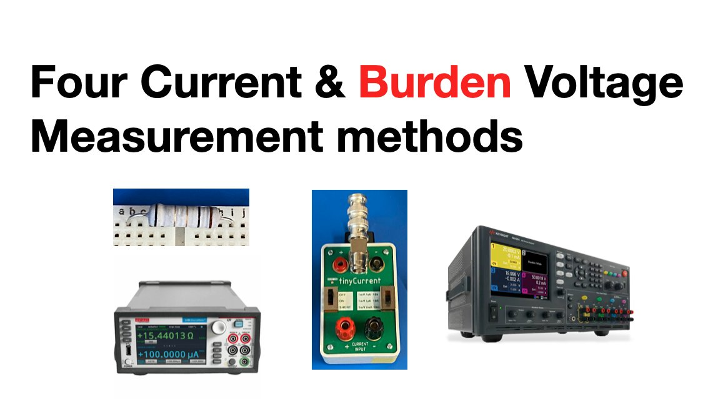

 Jie.Lei@newcastle.ac.uk | Jie.Lei.contact@gmail.com 
 
 [🎓 Google Scholar](https://scholar.google.com/citations?user=g0nZZiMAAAAJ&hl=en&oi=ao){:target="_blank"} 
| [📽 Youtube](https://www.youtube.com/channel/UCbG3LTzpZPVncPePOpqxW9w){:target="_blank"}    |   [🐧 Twitter](https://twitter.com/That_JieLei){:target="_blank"}

---

[⇦ Back Home](https://jiegh.github.io/about/)

#### **4 methods of Current measurement & Comparison**

- [📽 Video on Youtube](https://www.youtube.com/watch?v=l88mAXGDyJU){:target="_blank"}

- [❓ What is Burden Voltage](https://zone.ni.com/reference/en-XX/help/370384V-01/dmm/burden_voltage/#:~:text=Burden%20voltage%20is%20the%20voltage,kept%20as%20low%20as%20possible.){:target="_blank"}

- [❓ What is TinyCurrent](https://www.n-fuse.co/devices/tinyCurrent-precision-low-Current-Measurement-Shunt-and-Amplifier-Device.html){:target="_blank"}

- [❓ What is Shunt resister](https://hackaday.com/2018/02/08/how-current-shunts-work/){:target="_blank"}

---

## 1.0 Using Shunt resister

### 1.1 Wiring

### 1.2 Meeasurement results:
| V_PowSup 	| V_10KR in V 	| V Drop 	| V_Shunt in mV 	| P_10KR in mW 	| Delta P in mW 	|
|-	|-	|-	|-	|-	|-	|
| 1 	| 0.9878 	| 1.22% 	| 9.812 	| 9.69 	| -0.33 	|
| 1.4 	| 1.3824 	| 1.26% 	| 13.728 	| 18.98 	| -0.64 	|
| 1.8 	| 1.7774 	| 1.26% 	| 17.644 	| 31.36 	| -1.12 	|
| 2.2 	| 2.1716 	| 1.29% 	| 21.557 	| 46.81 	| -1.66 	|
| 2.6 	| 2.5664 	| 1.29% 	| 25.475 	| 65.38 	| -2.39 	|
| 3 	| 2.9609 	| 1.30% 	| 29.388 	| 87.01 	| -3.09 	|
| 3.4 	| 3.3589 	| 1.21% 	| 33.338 	| 111.98 	| -3.74 	|
| 3.8 	| 3.7534 	| 1.23% 	| 37.255 	| 139.83 	| -4.70 	|
| 4.2 	| 4.148 	| 1.24% 	| 41.173 	| 170.79 	| -5.80 	|
| 4.6 	| 4.5425 	| 1.25% 	| 45.093 	| 204.83 	| -7.11 	|
| 5 	| 4.9373 	| 1.25% 	| 49.015 	| 242.00 	| -11.52 	|
| AVG 	|   	| 1.25% 	|   	|   	| -3.83 	|

## 2.0 Using TinyCurrent

### 2.1 Wiring

### 2.2 Meeasurement results:
| V_PowSup 	| V_10KR in V 	| V Drop 	| I_10KR in mA 	| P_10KR in mW 	| Delta P in mW 	|
|-	|-	|-	|-	|-	|-	|
| 1 	| 0.9948 	| 0.52% 	| 9.955 	| 9.90 	| -0.12 	|
| 1.4 	| 1.392 	| 0.57% 	| 13.959 	| 19.43 	| -0.19 	|
| 1.8 	| 1.7898 	| 0.57% 	| 17.9839 	| 32.19 	| -0.29 	|
| 2.2 	| 2.1869 	| 0.60% 	| 21.93 	| 47.96 	| -0.52 	|
| 2.6 	| 2.5844 	| 0.60% 	| 25.903 	| 66.94 	| -0.82 	|
| 3 	| 2.9817 	| 0.61% 	| 29.864 	| 89.05 	| -1.06 	|
| 3.4 	| 3.3826 	| 0.51% 	| 33.881 	| 114.61 	| -1.11 	|
| 3.8 	| 3.7797 	| 0.53% 	| 37.859 	| 143.10 	| -1.43 	|
| 4.2 	| 4.1771 	| 0.55% 	| 41.841 	| 174.77 	| -1.81 	|
| 4.6 	| 4.5745 	| 0.55% 	| 45.832 	| 209.66 	| -2.28 	|
| 5 	| 4.972 	| 0.56% 	| 49.818 	| 247.70 	| -5.83 	|
| AVG 	|   	| 0.56% 	|   	|   	| -1.40 	|

## 3.0 Using multimeter 

### 3.1 Wiring

### 3.2 Meeasurement results:
| V_PowSup 	| V_10KR in V 	| V Drop 	| I_10KR in mA 	| P_10KR in mW 	| Delta P in mW 	|
|-	|-	|-	|-	|-	|-	|
| 1 	| 0.992 	| 0.80% 	| 9.928 	| 9.85 	| -0.17 	|
| 1.4 	| 1.388 	| 0.86% 	| 13.9 	| 19.29 	| -0.32 	|
| 1.8 	| 1.7858 	| 0.79% 	| 17.872 	| 31.92 	| -0.56 	|
| 2.2 	| 2.1821 	| 0.81% 	| 21.839 	| 47.65 	| -0.82 	|
| 2.6 	| 2.5786 	| 0.82% 	| 25.809 	| 66.55 	| -1.22 	|
| 3 	| 2.9751 	| 0.83% 	| 29.777 	| 88.59 	| -1.51 	|
| 3.4 	| 3.3751 	| 0.73% 	| 33.783 	| 114.02 	| -1.69 	|
| 3.8 	| 3.7715 	| 0.75% 	| 37.753 	| 142.39 	| -2.14 	|
| 4.2 	| 4.168 	| 0.76% 	| 41.726 	| 173.91 	| -2.67 	|
| 4.6 	| 4.5645 	| 0.77% 	| 45.7 	| 208.60 	| -3.34 	|
| 5 	| 4.9613 	| 0.77% 	| 49.674 	| 246.45 	| -7.07 	|
| AVG 	|   	| 0.79% 	|   	|   	| -1.96 	|

## 4.0 Using Power Analyzer, 4 Wire 

### 4.1 Wiring

### 4.2 Meeasurement results:
| V_PowSup 	| V_10KR in V 	| I_10KR in mA 	| P_10KR in mW 	|
|-	|-	|-	|-	|
| 1 	| 1.00018 	| 10.02 	| 10.02 	|
| 1.4 	| 1.40022 	| 14.01 	| 19.62 	|
| 1.8 	| 1.80024 	| 18.04 	| 32.48 	|
| 2.2 	| 2.2004 	| 22.03 	| 48.47 	|
| 2.6 	| 2.6004 	| 26.06 	| 67.77 	|
| 3 	| 3.0004 	| 30.03 	| 90.10 	|
| 3.4 	| 3.4004 	| 34.03 	| 115.72 	|
| 3.8 	| 3.8004 	| 38.03 	| 144.53 	|
| 4.2 	| 4.2004 	| 42.04 	| 176.58 	|
| 4.6 	| 4.6004 	| 46.07 	| 211.94 	|
| 5 	| 5.0004 	| 50.7 	| 253.52 	|

---

## Delta P cross 3 in-accuract methods

---
---
---

