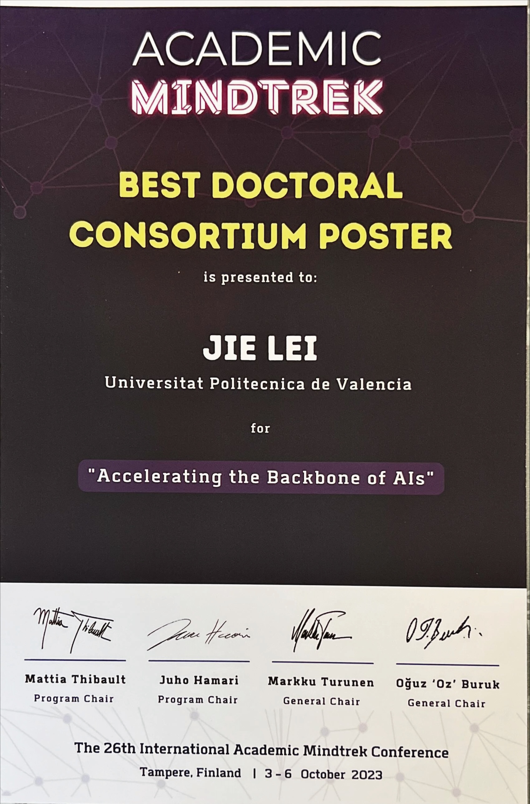

JLEI@DISCA.UPV.ES | Jie.Lei.contact@gmail.com 
 
 [🎓 Google Scholar](https://scholar.google.com/citations?user=g0nZZiMAAAAJ&hl=en&oi=ao){:target="_blank"} 
| [💼 Linkedin](https://www.linkedin.com/in/jie-l-142889139/){:target="_blank"} 
| [📽 Youtube](https://www.youtube.com/channel/UCbG3LTzpZPVncPePOpqxW9w){:target="_blank"}    |   [🐧 Twitter](https://twitter.com/That_JieLei){:target="_blank"}

---

[⇦ Back Home](https://jiegh.github.io/about/)

##### **MINDTREK 2023**

Hi there 👋, my name is Jie Lei the Early Stage Researcher of the [APROPOS](https://www.apropos-itn.eu/){:target="_blank"} project, based in the [Universitat Politècnica de València](https://www.upv.es/){:target="_blank"}, Spain. I am working on compute acceleration on AMD Xilinx Versal, utilizing SIMD processors, FPGA, along with custom memory hierarchy to accelerate the matrix multiplication. 

---

#### Poster

[Poster](Mindtrek2023_poster_DC.pdf){:target="_blank"}

#### Poster breakdown

#### Award

Best Doctoral Consortium Poster Award

---
#### To Learn more about this work:

[GEMM-Like Convolution for Deep Learning Inference on the Xilinx Versal](https://zenodo.org/record/8309224){:target="_blank"}

[Toward Matrix Multiplication for Deep Learning Inference on the Xilinx Versal](https://zenodo.org/record/8009676){:target="_blank"}

---

#### Acknowledgement

This work is supported by the European Union’s Horizon 2020 research and innovation programme under the Marie Skłodowska-Curie grant agreement No 956399 (APROPOS).

---

##### To learn more about this platform:

[AMD Xilinx Versal](https://docs.xilinx.com/v/u/en-US/wp505-versal-acap)

[AMD AI Engine](https://docs.xilinx.com/v/u/en-US/wp506-ai-engine)

AMD, AI Engine, Xilinx, Versal are trade marks of the AMD.

